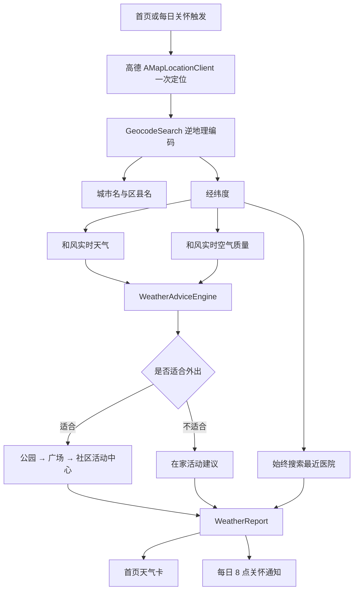

# Silver Guardian 课程新需求改造更新说明

- 更新日期：2026-06-21
- 项目：Silver Guardian（银发守护者）
- 状态：代码实现与本地自动化验证完成，等待配置真实天气凭据并执行最终真机验收
- 需求依据：`docs/AGENT_INSTRUCTIONS.md`、`docs/adr/0003-comprehensive-requirements-redesign.md`、`CONTEXT.md`

## 1. 更新摘要

本次更新在保留 `AppContainer → Module → Repository/DAO` 架构的前提下，完成了课程新需求的主要改造，并根据模拟器、真机人工验收结果修复了多项界面与可靠性问题。

主要成果包括：

- 数据库升级到 v2，业务数据按当前老人隔离。
- 健康档案、用药提醒、药品库、AI 对话、亲情相册形成数据闭环。
- 用药提醒页与相册页改为单 RecyclerView 多 ViewType 整页滚动。
- 相机、MediaStore、PIN 提示、精确闹钟、开机恢复等流程得到补充。
- 高德地图支持附近 POI、步行路线、路线信息栏和导航跳转。
- 首页支持标准、加大、特大三档布局，并加入一键呼叫、SOS 和天气出行建议。
- 每日关怀通知整合天气、出行建议与当日用药摘要。
- 修复模拟器开机广播崩溃、标准首页字段消失、健康页面字段消失等人工验收问题。

## 2. 架构与数据层更新

### 2.1 数据库与多老人隔离

数据库版本提升为 v2，主要结构变化如下：

- `users` 增加 PIN 提示问题与答案。
- `health_data` 保存状态、备注和创建时间。
- `user_medicines` 增加提前提醒、重复次数和重复间隔。
- `medicine_library` 按老人保存药品库，并支持同老人药名去重。
- 新增按老人隔离的防骗贴士数据。
- `emergency_alerts` 使用数据库实际时间和状态字段。

当前老人 ID 由登录会话持久化，Repository/DAO 不再默认使用 `user_id=1`。新建老人时，在同一业务流程中初始化默认药品库与防骗贴士模板。

### 2.2 深模块边界

平台与业务逻辑继续放在独立模块内：

- `MedicineAlarmScheduler`：用药闹钟调度、取消和恢复。
- `DrugRecommendationParser`：AI 药品推荐 JSON 解析与兜底识别。
- `PhotoStorage`：照片私有副本与 MediaStore 公共副本保存。
- `WeatherModule`：定位、逆地理编码、天气/AQI、出行判断与 POI 推荐。
- `WeatherClient`：和风天气 HTTP 请求。
- `QWeatherResponseParser`：和风天气响应解析。
- `WeatherAdviceEngine`：纯 Java 出行判断规则。

Fragment/Activity 主要负责 XML 绑定、状态展示、权限请求与页面跳转。

## 3. 功能更新

### 3.1 健康档案

- 今日健康档案严格按本地日期查询。
- 血压、心率、血氧和睡眠分别显示当天最新记录。
- 支持 13 种健康指标手动录入、单位提示、备注和异常判断。
- “更多记录”使用 RecyclerView 与 `item_health_card.xml` 展示当天记录。
- 健康概览、手动记录和健康告警复用统一异常判断逻辑。
- 补齐健康页面标题、AI 分析卡、操作按钮等此前未绑定的文字字段。

### 3.2 用药提醒与药品库

- 药品提醒支持提前提醒、重复次数和重复间隔。
- 添加药品后立即调度，删除药品时同步取消，开机后恢复。
- Android 12+ 检查精确闹钟能力；无权限时安全降级为非精确闹钟。
- 新增独立药品库页面，支持药名、疾病和品牌搜索。
- 老人模式只读，子女模式支持新增、编辑和删除。
- 用药提醒页已重构为单个全屏 RecyclerView：
  - Header ViewType：页面标题、添加药品、进度、类型筛选和状态提醒。
  - 普通 ViewType：药品提醒卡片。
  - 顶部内容随页面一起滚动，不再固定占据屏幕空间。

### 3.3 AI 智能对话

- AI system prompt 动态加入当前老人的药品库、用药计划和服药打卡状态。
- 支持结构化 `drugs` JSON、Markdown JSON、破损 JSON 和药品关键词兜底解析。
- JSON 控制块不会直接显示在聊天气泡中。
- 推荐药品通过确认流程进入药品库和用药提醒。
- 空会话首次进入时自动初始化欢迎语：
  - “我是银发守护者智能助手，专门为老年人提供健康管理、用药提醒、生活辅助等服务。”
- 麦克风支持长按开始、松开结束，最终识别结果自动发送。
- AI 回复根据语音开关统一播报。

### 3.4 亲情相册

- 支持拍照与系统相册选择。
- 拍照使用 FileProvider 获取完整尺寸照片。
- 上传流程为：选择来源 → 预览 → 填写标题和留言 → 保存。
- 相册列表与相册详情改为单 RecyclerView 多 ViewType：
  - 相册列表 Header：个人信息、家庭横幅、全部照片入口、我的相册标题。
  - 相册卡片：网格 item。
  - Footer：创建新相册按钮。
  - 相册详情 Header：返回栏、横幅、记忆说明、全部照片标题。
  - 照片：网格 item。
  - Footer：排序、搜索、上传照片操作。
- 创建相册和上传照片入口不再位于独立滚动区之外。

### 3.5 登录、提醒与紧急呼叫

- 登录页支持 PIN 显示/隐藏。
- 支持提示问题与提示答案验证，答案 trim 后精确匹配。
- 每日关怀和用药提醒均处理 Android 12+ 精确闹钟权限。
- SOS 使用课程测试号码 `10086`，提供 10 秒倒计时。
- SOS 按钮改为实心红色，提高紧急操作辨识度。
- 一键呼叫只展示家属，不加入测试急救号码。

### 3.6 高德地图与导航

- 高德定位结果作为 POI 搜索中心。
- 点击 POI 后请求步行路线并绘制路线。
- 地图信息栏显示地点、距离和预计步行时间。
- 已安装高德地图时跳转 App 导航。
- 未安装时先询问用户，再打开网页版导航。
- 首页天气卡可根据出行判断跳转高德页面：
  - 适合外出时默认搜索公园。
  - 不适合外出时默认搜索医院。

### 3.7 三档首页与子女模式

- 标准模式：完整首页、健康概览、呼叫操作、快捷入口、AI 卡片和天气卡片。
- 加大模式：呼叫操作、四宫格入口和今日用药汇总。
- 特大模式：SOS、一键呼叫、用药提醒、智能对话四个纵向大按钮。
- 子女模式加入一键回拨、添加用药、药品库管理和一次性定位入口。

## 4. 天气出行建议实现

### 4.1 处理流程



### 4.2 判断规则

满足以下任一条件时，不建议外出：

- 天气包含雨、雪、大风、强风、暴风或台风。
- 当前温度高于 35°C 或低于 5°C。
- AQI 高于 150。
- 天气、温度或空气质量关键数据不可用。

只有天气、温度和 AQI 三项全部通过时，才显示适合外出。

### 4.3 POI 推荐与降级

- 在当前位置 5 公里范围内搜索最多 3 个休闲地点。
- 搜索顺序：公园 → 广场 → 社区活动中心。
- 无论天气是否适合外出，均搜索最近医院。
- POI 全部失败时仍显示天气，但不显示虚构地点。
- 定位、高德或网络长期不回调时，15 秒后返回安全降级结果。

### 4.4 和风天气接口

当前实现使用：

- 实时天气：`/v7/weather/now?location={longitude},{latitude}`
- 实时空气质量：`/airquality/v1/current/{latitude}/{longitude}`
- 鉴权请求头：`X-QW-Api-Key`

配置来自 `local.properties`，不会写死到源码：

```properties
qweather.api.key=你的和风天气API Key
qweather.api.host=控制台-设置中显示的专属API Host
```

API Host 形如：

```text
abc1234xyz.def.qweatherapi.com
```

不要添加 `https://` 或接口路径。Key 或 Host 任一为空时，应用会显示安全降级文案，不会构造非法请求。

官方参考：

- https://dev.qweather.com/docs/configuration/api-host/
- https://dev.qweather.com/docs/configuration/authentication/
- https://dev.qweather.com/docs/api/weather/weather-now/
- https://dev.qweather.com/docs/api/air-quality/air-current/

## 5. 人工验收问题与修复记录

| 问题 | 根因 | 修复结果 |
|---|---|---|
| 模拟器开机后闪退 | `DailyCareReceiver` 无权限直接调用精确闹钟 | 增加能力检查、异常捕获和非精确闹钟降级 |
| 标准首页只有线框，没有文字和图标 | XML 字段为空，Fragment 未完整绑定 | 补齐健康指标、快捷入口、AI 卡片和欢迎区绑定 |
| 健康“更多记录”文字消失 | 多个稳定字段留空且未绑定 | 补齐记录标题、空状态、AI 分析和操作按钮文字 |
| 相册缺少创建/上传入口 | 操作位于独立列表后方或空状态分支不可见 | 改为 RecyclerView Header/Footer ViewType |
| 天气卡过大或位置错误 | 卡片顺序与尺寸不符合最新验收要求 | 缩小卡片并按最新要求放到 AI 卡片下方 |
| AI 初始欢迎语消失 | 只有重置对话时写入欢迎消息 | 空消息表首次加载时自动初始化 |
| SOS 不够醒目 | 使用浅红背景 | 改为实心红色背景 |
| 用药与相册顶部区域固定 | 固定面板加独立 RecyclerView | 改为单 RecyclerView 整页滚动 |

## 6. 自动化验证

最终本地验证结果：

- 单元/Robolectric 测试：44 项
- 失败：0
- 错误：0
- `:app:testDebugUnitTest`：通过
- `:app:processDebugResources`：通过
- `:app:compileDebugJavaWithJavac`：通过
- `:app:assembleDebug`：通过

生成 APK：

```text
D:\Android Studio\app\build\outputs\apk\debug\app-debug.apk
```

构建信息：

- 文件大小：65,082,369 字节
- 构建时间：2026-06-21 00:19:30

新增天气测试覆盖：

- 雨雪等恶劣天气判断。
- 高温、低温边界判断。
- AQI 150 阈值判断。
- 正常天气适合外出判断。
- 和风实时天气与当前 AQI JSON 解析。
- 破损 JSON 安全降级。

## 7. 最终真机验收清单

### 7.1 天气与定位

- 在和风控制台创建项目和 API Key。
- 将专属 API Host 与 Key 写入 `local.properties`。
- 重新编译并安装 APK。
- 首次进入标准首页时允许定位权限。
- 验证城市、区县、天气、温度、AQI 正确显示。
- 晴好天气验证公园/广场/社区活动中心降级推荐。
- 恶劣天气验证在家活动建议。
- 验证最近医院始终显示。
- 点击天气卡，确认高德页面按公园或医院搜索。
- 点击地点，确认步行路线、距离、时间和导航跳转。

### 7.2 每日关怀

- 临时调整触发时间或通过测试入口触发 Receiver。
- 验证通知包含天气、出行建议和今日用药。
- 关闭网络后验证仍能发送安全降级通知。
- 未授权精确闹钟时验证应用不崩溃。

### 7.3 其他人工验收

- 相机拍摄、系统相册选择及重启后照片读取。
- MediaStore 公共副本与私有副本。
- TTS 播报与语音识别。
- 用药添加、删除、提前提醒和重复提醒。
- 多老人切换后的业务数据隔离。
- 标准、加大、特大三档首页。
- `10086` 课程测试呼叫流程。

## 8. 当前限制与待办

1. `local.properties` 中的和风天气 API Key 与专属 API Host 当前为空，因此现有 APK 只会展示天气安全降级文案。
2. 填写凭据后必须重新构建 APK，BuildConfig 才会包含新配置。
3. 相机、MediaStore、高德定位/导航、TTS、通知权限和真实网络状态仍需真机最终确认。
4. 当前自动化验证未替代 instrumentation 测试和真实 8:00 定时触发验证。
5. 工作区存在与本轮交付无关的未跟踪文档、压缩包和临时脚本；本次未删除、覆盖或提交这些文件。

## 9. 关键文件索引

### 天气与地图

- `app/src/main/java/com/silverguardian/prototype/weather/WeatherModule.java`
- `app/src/main/java/com/silverguardian/prototype/weather/WeatherClient.java`
- `app/src/main/java/com/silverguardian/prototype/weather/QWeatherResponseParser.java`
- `app/src/main/java/com/silverguardian/prototype/weather/WeatherAdviceEngine.java`
- `app/src/main/java/com/silverguardian/prototype/weather/WeatherReport.java`
- `app/src/main/java/com/silverguardian/prototype/CommunityActivity.java`
- `app/src/main/res/layout/view_weather_card.xml`

### 健康、用药与相册

- `app/src/main/java/com/silverguardian/prototype/fragments/HealthFragment.java`
- `app/src/main/java/com/silverguardian/prototype/fragments/MedicineFragment.java`
- `app/src/main/java/com/silverguardian/prototype/fragments/AlbumFragment.java`
- `app/src/main/res/layout/item_medicine_page_header.xml`
- `app/src/main/res/layout/item_album_list_header.xml`
- `app/src/main/res/layout/item_album_detail_header.xml`
- `app/src/main/res/layout/item_album_create_footer.xml`
- `app/src/main/res/layout/item_album_photo_footer.xml`

### 提醒与测试

- `app/src/main/java/com/silverguardian/prototype/reminder/DailyCareReceiver.java`
- `app/src/main/java/com/silverguardian/prototype/reminder/MedicineAlarmScheduler.java`
- `app/src/test/java/com/silverguardian/prototype/AcceptanceRegressionTest.java`
- `app/src/test/java/com/silverguardian/prototype/weather/WeatherAdviceEngineTest.java`
- `app/src/test/java/com/silverguardian/prototype/weather/QWeatherResponseParserTest.java`

## 10. 交付结论

课程新需求的主要代码改造、人工验收问题修复、天气出行建议链路与自动化测试已经完成。当前进入最终配置与真机联调阶段：配置和风天气专属 API Host 与 Key 后，重新构建 APK，并按第 7 节完成定位、天气、AQI、高德 POI、每日关怀及平台权限验收。